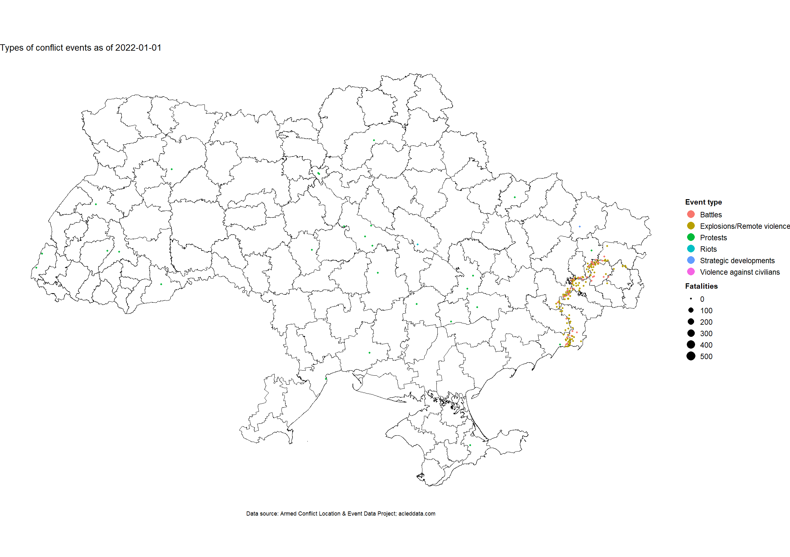
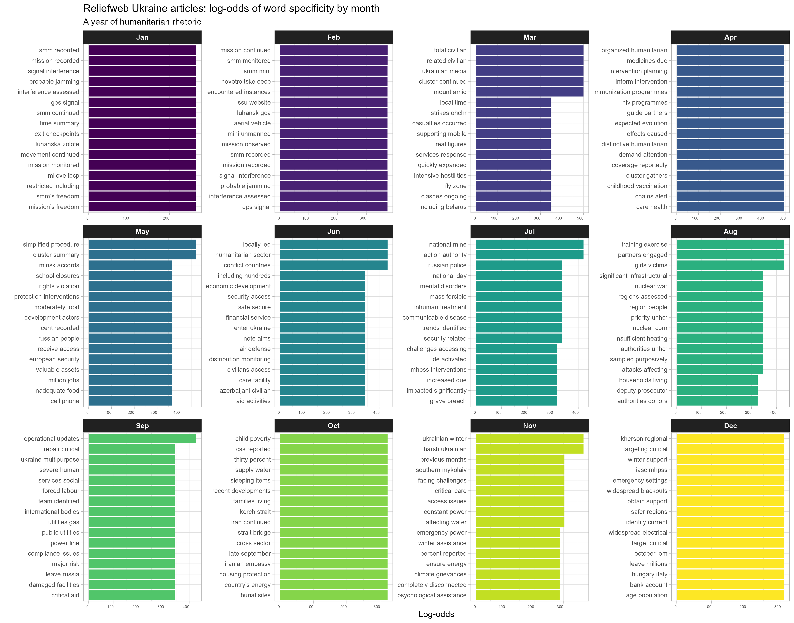

```{css, echo=FALSE}

#TOC::before {
  content: "";
  display: block;
  height: 100px;
  margin: 2em 20px 20px 20px;
  background-image: url("logo_sean.png");
  background-size: contain;
  background-position: center center;
  background-repeat: no-repeat;
}
```

```{=html}
<style>
    body .main-container {
        max-width: 1280px;
    }
</style>
```

```{r setup, include=FALSE}
knitr::opts_chunk$set(echo = FALSE, fig.width=9, message = FALSE, warning=FALSE)
library(tidyverse)
library(tidytext)
library(ggraph)
library(tidylo)
library(widyr)
library(janitor)
library(lubridate)
library(SnowballC)
library(magrittr)
library(patchwork)
library(tidylo)
library(DT)
library(flextable)

`%out%` <- Negate(`%in%`)

range_wna <- function(x){(x-min(x, na.rm = TRUE))/(max(x, na.rm = TRUE)-min(x, na.rm = TRUE))}

theme_set(theme_light())
```

```{r data}
ukr_links <- read_csv("./data/reliefweb_ukr_links.csv") %>% 
  rename(url = value) %>% 
  mutate(id = row_number())

# This is the list of Spanish and French links 
to_remove <- read_csv("./data/links_to_remove.csv") %>% 
  rename(url = value) %>% 
  pull(url)

rw <- read_csv("./data/scraped_full_20230101_20220101.csv") %>% 
  mutate(date = dmy(date), 
         month = month(date)) %>% 
  left_join(ukr_links, by = c("link" = "url")) %>%
  filter(link %out% to_remove) 

tf_idf_bigrams_odds <- read_csv("./data/tf_idf_bigrams_odds.csv")

more_than_5 <- rw %>% 
  count(source, sort = TRUE) %>% 
  filter(n >= 5) %>% 
  pull(source)
```


## Introduction 

Text mining and analytics were conducted on a dataset of scraped Reliefweb.int (RW) articles on Ukraine. Articles were limited to the year 2022 and the English language. A total of `r nrow(ukr_links) %>% format(big.mark = ",")` documents were scraped, tokenised and all stop words (the, a, we, can) were removed. 

A brief examination of the most common word pairs in RW articles on Ukraine yields this network graph. Only more common word pairs have been included and the thickness of the line between them indicates the number of times this pair appears in the corpus. 

<br>

[](https://raw.githubusercontent.com/seanywng/ukraine-humanitarian-helper/main/plots/title_network_graph.png){target="_blank"}
*[Full-sized graph](https://raw.githubusercontent.com/seanywng/ukraine-humanitarian-helper/main/plots/title_network_graph.png){target="_blank"}*

<br>

This is all very much expected.Titles only give us the merest of glimpses into the response and provides us no further knowledge besides could be obtained from casually watching the news. Whilst `Ukraine` is obviously central to the corpus, as are `war` and `situation` `report` we see smaller, but quite meaningful clusters. These include `fiscal` and `fy` as well as `snapshot`, `funding` and `appeal`. 

However, we see that most of the corpus deals with situation updates or press releases (see the centrality of `media` and `government`). Relatively limited is information on achievements -- `estimated`, `reached`, `assistance`, `cash` and `relief` do not form a large proportion of the titles. 

If we take a look at the most common word pairs in the text of the scraped articles, it doesn't provide too much additional detail. As with the graph above, the thickness of the line indicates the nubmer of co-occurences. 

<br>

[](https://raw.githubusercontent.com/seanywng/ukraine-humanitarian-helper/main/plots/word_pair_network_graph.png){target="_blank"}
*[Full-sized graph](https://raw.githubusercontent.com/seanywng/ukraine-humanitarian-helper/main/plots/word_pair_network_graph.png){target="_blank"}*

<br>

If I knew nothing about the situation in Ukraine, from this graph, I can glean that there is a war and a humanitarian response to it. I see multiple sectors being mentioned, as well as refugees. The word `million` shows up, as does `scale`. 

I suppose this would work as a primer in other emergencies, but we will need a way to sort through the boilerplate (we will get to this later). 

Let us, finally, take a macro-view of the dataset and plot, in a bit more detail, the correlations between word pairs -- bigrams -- within the corpus. So that we may get a lay of the land, so to speak. 

This network graph is not only much more complex, but it is also formed of word pairs -- bigrams -- as this tends to improve interpretability at the cost of sensitivity. However, now the main patterns in the RW corpus are visible. This is the lay of the land, so to speak. 

<br>

[](https://github.com/seanywng/ukraine-humanitarian-helper/raw/main/plots/network_graph_kk_full.png){target="_blank"}
*[Download full-sized graph](https://github.com/seanywng/ukraine-humanitarian-helper/raw/main/plots/network_graph_kk_full.png){target="_blank"}* 

<br>

Any bigram that appears here has at minimum occurred 50 times in the corpus and has at least a 0.15 correlation with at least one other bigram (that they can be found in the same document 15% of the time). 

Immediately, we note that large proportions of RW are tied to conflict reporting (coming largely from OSCE and ACLED) as well as numerous releases from the IAEA. Both are imporant, but it would be far easier to analyse them separately, and, in the case of ACLED, it is much better to analyse the content of each conflict event's description, as opposed to using the general weekly ACLED report that RW has been uploading -- the issue there being words like `Kazakhstan` or `Tibet` come up because ACLED weekly reports cover all countries. 

We can now see the full spectrum of rhetoric on Ukraine -- `respect international`, `humanitarian law`, `recognised borders`, `war crimes`, and of course, `human rights` are front and centre. I wish these Europeans would be as concerned about human rights in other parts of the world as well. 

But we also start to see certain keywords of high importance to persons in the industry, frequently appearing in the news: `black sea` `grain initiative`, `humanitarian corridors` and `gender based violence`. 

<br><br><br>

## Months 

So, now that we can see grand strokes, of the corpus, how do we extract a bit more value from this dataset? One easy win is to look at this emergency through the lens of time -- it is a hot conflict, after all. 

Let's start by looking at a simple GIF of conflict events across the whole of 2022, based on the ACLED dataset: 

<br>

[](https://raw.githubusercontent.com/seanywng/ukraine-humanitarian-helper/main/plots/event_type_2022.gif){target="_blank"}
*[Full-sized GIF](https://raw.githubusercontent.com/seanywng/ukraine-humanitarian-helper/main/plots/event_type_2022.gif){target="_blank"}* 


<br>

So we can see that there are clear patterns to the violence. Milbloggers definitely have much better analysis there. But, applying this to the RW corpus, let us use log-odds to separate out bigrams by month. The logarithm of the odds that a word appears in a given month in the metric by which we use to determine which words are the most unique to each month. 

This is the first product we have developed that is easily interepretable and adds significantly to our understanding of the crisis.

<br>

[](https://raw.githubusercontent.com/seanywng/ukraine-humanitarian-helper/main/plots/bigram_months_bar.png){target="_blank"}
*[Full-sized plot](https://raw.githubusercontent.com/seanywng/ukraine-humanitarian-helper/main/plots/bigram_months_bar.png){target="_blank"}* 

<br><br><br>


## Sources 

As demonstrated by the tightly-knit clusters of bigrams surrounding IAEA, ACLED and OSCE submissions, the source matters a lot. Furthermore, we would also dearly believe that each of the agencies we work for has its own specialities and particularities that make it our preferred actor. 

<br><br>

### Tf, tf-idf and log-odds

We will explore what each source has written by looking at: 

* Term frequency 
* Term frequency-indirect document frequency
* Log-odds

Term frequency here shows us the phrases that each organisation uses most commonly. Often, their name or their mandate ("food assistance") will appear in this list. 

Tf-idf (term frequency-inverse document frequency) is another measure by which significant words are identified. The term frequency -- the number of times a term appears in the corpus -- is tempered by the inverse document frequency, which discounts words that tend to appear again and again (think "humanitarian assistance" or "including women"). The combined metric is useful for determining which words are common, but not too common. A suspicious-minded person might even say that this is where we may find what agencies really care about, as opposed to the boilerplate that they flood every report with. 

Finally, we also evaluate words within a corpus by looking at their log-odds. What this means, for this section, is that the words appearing in under the log-odds are more likely to originate from that source over any other sources. This is where we see what unique information each source brings to the table. 

<br><br>

### Bigram plots by source

A series of plots has been generated for each source with more than 5 contributions to RW in 2022 about Ukraine. Each plot shows the top bigrams by term frequency, tf-idf and log-odds.

The organisations below are just a small selection of all bigram plots by source. All the plots may be viewed [here](). 

If you see a bigram you're curious about, just make use of the **Bigram Search Helper**. Just type the bigram or source or date into the relevant searchbox. 

<br><br>

#### ACAPS


Let's start with ACAPS, because it comes first alphabetically and most people would have read at least some of their material. 

Overall, it seems that ACAPS is concerned foremost with access constraints, with the top 3 of its tf-idf list being rounded out by `active` `ground` `conflict`. ACAPS also shows which sources it prizes highly -- `REACH`and `UNHCR`, likely influencing the placement of `building materials` at the top of the bigrams with the highest log-odds. Strangely, this is not reflected in UNHCR's own list of bigrams. 

<br><br>

#### Plan International


<br>

Plan International is a good example of a responsible investment. Their log-odds mentions a [multi-]`sectoral response`, as well as the statement [regardless of?] `religion` `country` `age` `ability` `sexuality` `perceived differences`, indicating a strong (or at least more vocal) commitment to human rights, though it could just be boilerplate (we'd have to check further down the Term frequency column). Other language such as `provide holistic` and `initial service` indicates fair programmatic thinking. All this makes Plan International a strong candidate if I were looking for a full-service NGO. 

<br><br>

#### Malteser International 


Much less informative are the documents originating from Malteser International. It just seems like a lot of press releases mentioning senior staff. Whilst there would definitely be much more detail in a report, I would also not really prioritise reading any of their products. Look at Christian Aid for another negative example.  

<br>

#### European Commission 


<br>

Changing lanes a bit, the EC's rhetoric seems to be very consistent. The acceptance of `hryvnia banknotes` and `solidarity lanes ` are clearly an important pieces of the response that the EC would like to highlight. And yes, these actions are laudable, but I also feel very irritated to have to ask why we can do this for white Europeans but not the Rohingya. We could have arranged for their gold to be sold at fair prices. 

Otherwise, the EC cares about `VET schools`, `vocational education` and `eu4skills protection`. This also indicates a level of investment in human capital (after all, they might one day be EU citizens) that is absent in other parts of the world. Not to shame Europe, but just goes to show how useless ASEAN is. 

<br>

#### Govt. of Ukraine 


<br>

I'd also question the "curation" that has occurred with the Govt. of Ukraine's statements on RW. I'm not really sure that this is what the Ukrainian government would like to communicate to the humanitarian community. Unless `educational institutions` are a cornerstone of the response, which funding indicates that they are not. The focus on `sexual violence` is less puzzling as the Ukrainian government might be signalling for humanitarian actors to move more fully into that space to complement state services. 


Simply, we do not know and would need to ask someone there. 


<br><br>

#### USAID 


<br>

Perhaps one of the most interesting things to check would be to see how well a donor's rhetoric aligns with their actions and their funding disbursements. Looking at the term frequencies, one could charitably interpret them USAID's main concerns as (in order), everything below `gorf attacks` does paint the picture of a typical donor. Does USAID mentioning `health facilities` more than `food assistance` mean that WHO will be getting more money than WFP? We'll check FTS.

Also unsurprisingly, USAID seems to be much more vocal about Russian attacks, which is the privilege of the world's only superpower. There is also much importance accorded to a USAID-funded [survey](https://reliefweb.int/report/ukraine/results-representative-survey-among-ukrainians-enuk) on societal attitudes in Ukraine. Did they pay for the survey to send a signal to that they're keen on social engineering? 

<br><br>

#### ACLED


<br>

Finally, let's take a look at ACLED. It should be quite apparent why I would want to analyse ACLED conflict event descriptions on their own -- what has been uploaded to RW are just ACLED's weekly reports, which cover Ukraine, but other things as well, such as `presidential elections`, the `overturn` of `roe` as well as mentions of `germany police`. This corpus is polluted. Furthermore, it provides irrelevant data to persons who search up ACLED on RW -- muddying the waters on one of main sources of incident tracking is quite unforgivable. 

See [here]() for a bigram network graph based on ACLED conflict event descriptions, instead of weekly collated reports. Immediately, one can see that the level of detail and utility is markedly different and the ACLED dataset contains much richer textual data than what has been uploaded to RW. 

<br><br><br>

### Bigram search helper 


```{r}
createLink <- function(val) {
  sprintf(paste0('<a href="', 
                 URLdecode(val),
                 '" target="_blank">', 
                 substr(val, 38, 85),
                 '</a>'))
}
```


```{r}

rbind(
  # Pay attention to the first one since the log-odds filtering is
  # so finnicky
  tf_idf_bigrams_odds %>%
    filter(source %in% more_than_5) %>%
    add_count(word, wt = n, name = "word_total") %>%
    filter(word_total > 3) %>%
    filter(!is.infinite(log_odds_weighted)) %>%
    distinct(source, word, .keep_all = TRUE) %>%
    group_by(source) %>% 
    slice_max(log_odds_weighted, n = 10) %>% 
    ungroup(),
  
  tf_idf_bigrams_odds %>%
    filter(source %in% more_than_5) %>%
    group_by(source) %>%
    slice_max(tf, n = 20) %>%
    ungroup(),
  
  tf_idf_bigrams_odds %>%
    filter(source %in% more_than_5) %>%
    group_by(source) %>%
    slice_max(tf_idf, n = 20) %>%
    ungroup()
  
) %>%
  left_join(rw %>% 
              select(id, link, body), 
            by = "id") %>%  
  left_join(rw %>% select(date, id), by = "id") %>%
  mutate(body = str_sub(body, 1, 150), 
         link = createLink(link)) %>% 
  filter(date >= "2022-01-01") %>% 
  distinct(word, id, source, .keep_all = TRUE) %>%  
  arrange(desc(n), desc(tf_idf)) %>% 
  select(source, 
         bigram = word, 
         count = n, 
         date, 
         `text (1st 150 char)` = body, 
         link, 
         -tf_idf) %>%  
  datatable(filter = list(position = "top", clear = TRUE), 
            options = list(pageLength = 10, 
                           scrollX = TRUE,
                           autoWidth = TRUE, 
                           columnDefs = list(
                             list(width = "80px", targets = 1:4),
                             list(width = "180px", targets = 4), 
                             list(width = "100px", targets = 5)),
                           search = list(regex = TRUE)
                           
                           ,
                                           initComplete = htmlwidgets::JS(
          "function(settings, json) {",
          paste0("$(this.api().table().container()).css({'font-size': '", "8.5pt", "'});"),
          "}")
       ),
  caption = htmltools::tags$caption(style = 'caption-side: top; 
                                    text-align: center; 
                                    color:black; font-size:140% ;',
                                    "Bigram search helper -- Reliefweb Ukraine terms in 2022")
     ,
  escape = FALSE)  
  # formatRound(c("correlation"), digits = 3)

```


